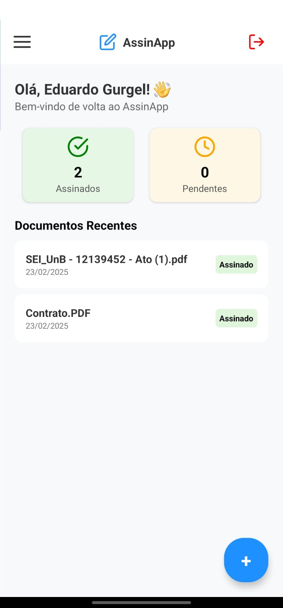

# AssinApp - Aplicativo de Assinatura Digital

<p align="center">
  
</p>

## Sobre o Projeto

O **AssinApp** é um aplicativo móvel para assinatura digital de documentos. O objetivo é proporcionar uma experiência intuitiva e segura para usuários que precisam assinar documentos de forma eletrônica.

<p align="center">
  
  
</p>


## Tecnologias Utilizadas

- **React Native** com Expo
- **FastAPI** para backend


## Como Rodar o Projeto

### Pré-requisitos

Certifique-se de ter instalado:

- **Node.js** (versão recomendada: 18+)
- **NPM** (`npm install -g npm@latest`)
- **Expo CLI** (`npm install -g expo-cli`)
- **Emulador Android** ou dispositivo físico com modo desenvolvedor ativado

### Passos para executar no Android

1. Clone o repositório:
   ```sh
   git clone git@github.com:AssinApp/Assina.git
   cd AssinApp
   ```
2. Instale as dependências:
   ```sh
   npm install
   ```
3. Execute o aplicativo no Android:
   ```sh
   npx expo run:android
   ```

### Passos para executar no iOS

Se estiver no macOS e quiser rodar no iOS:
   ```sh
   npx expo run:ios
   ```
> **Nota:** Para rodar no iOS, é necessário um ambiente com Xcode instalado.
